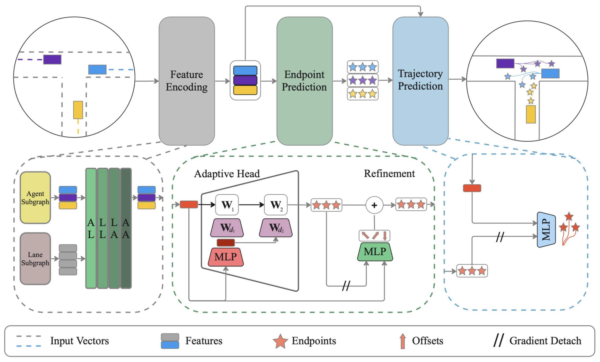
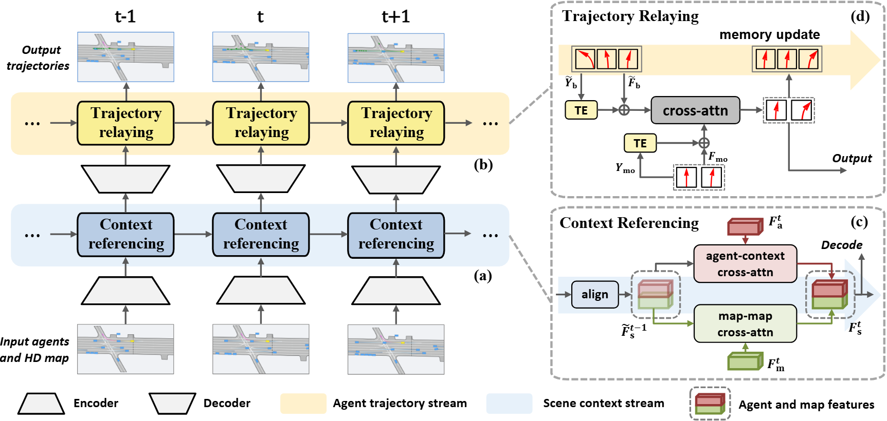
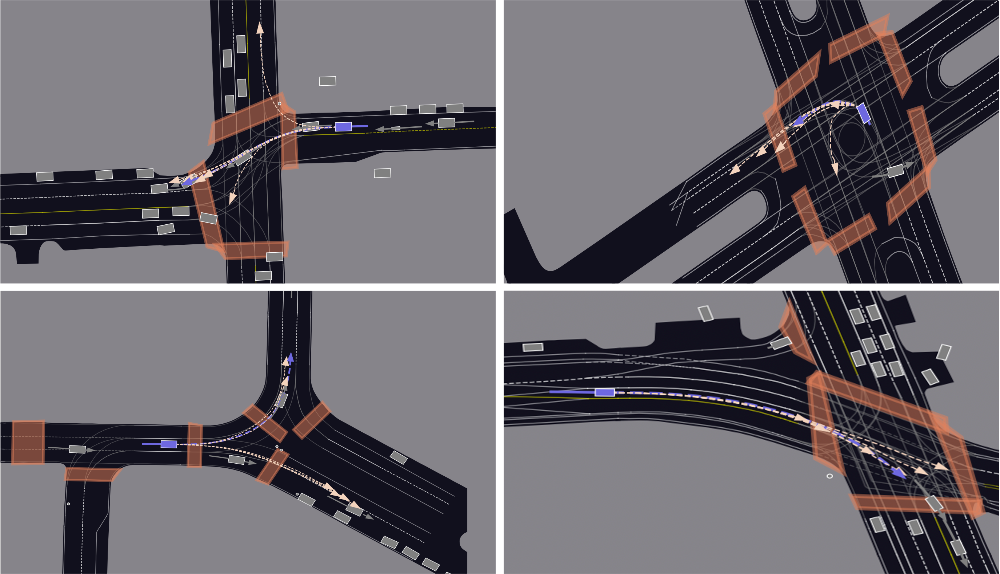
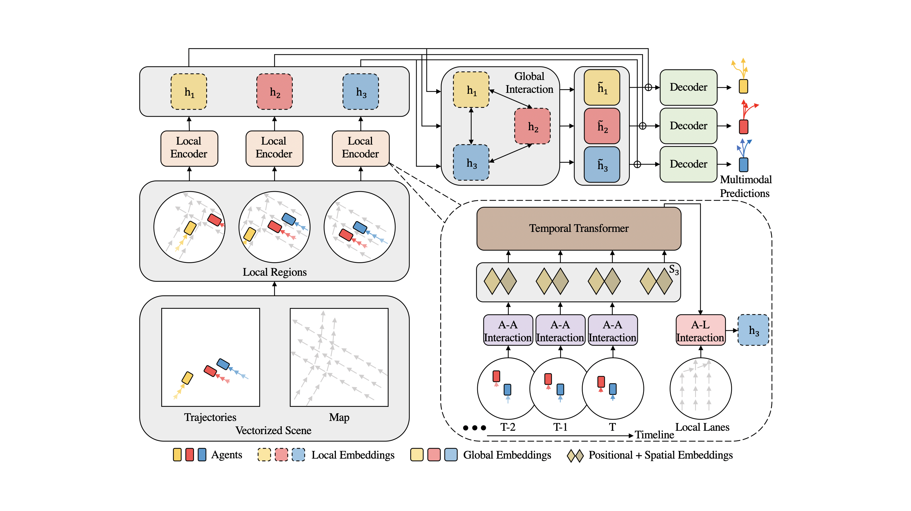
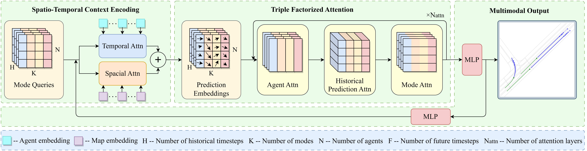

# Motion Forecasting Research Archive

This repository is a lightweight research archive rebuilt from `/h0/next`.
The original folder collected several trajectory prediction / motion forecasting
GitHub repositories and local experiment artifacts.

Large datasets, preprocessed data, checkpoints, logs, and submission files are
not included in this GitHub repository.

## Included Repositories

| Folder | Original project | Main dataset focus | Local role |
| --- | --- | --- | --- |
| `sources/realmotion` | RealMotion | Argoverse 2 | Continuous motion forecasting study |
| `sources/qcnet` | QCNet | Argoverse 2 | Argoverse 2 motion forecasting baseline |
| `sources/hivt` | HiVT | Argoverse 1.1 | Argoverse 1 motion forecasting baseline |
| `sources/adapt` | ADAPT | Argoverse 1.1 | Argoverse 1 trajectory forecasting baseline |
| `sources/hpnet` | HPNet | Argoverse 1.1, INTERACTION | Historical prediction attention baseline |

## Visual Summary

The archive keeps lightweight figures from the included motion forecasting projects. These are useful for quickly identifying the modeling direction of each source tree without restoring the full datasets or checkpoints.

| ADAPT | RealMotion |
| --- | --- |
|  |  |

| QCNet | HiVT |
| --- | --- |
|  |  |

| HPNet |
| --- |
|  |

## Local Dataset Status

The original `/h0/next` folder contained real datasets and processed artifacts:

- `/h0/next/Data/Argoverse1.1`: about 96 GB
- `/h0/next/Data/Argoverse2`: about 117 GB
- `/h0/next/QCNet/data`: about 48 GB of processed Argoverse 2 data
- `/h0/next/RealMotion/data/realmotion_processed`: about 28 GB
- `/h0/next/ADAPT/predata`: about 63 GB

These files are excluded here because they are too large for GitHub and usually
must be downloaded or regenerated separately.

See `docs/DATASETS.md` for the expected dataset layout.

## Repository Layout

```text
.
├── docs/
│   ├── DATASETS.md
│   ├── EXCLUDED_ARTIFACTS.md
│   └── SOURCE_MAP.md
└── sources/
    ├── adapt/
    ├── hivt/
    ├── hpnet/
    ├── qcnet/
    └── realmotion/
```

## Notes

This archive preserves source code, lightweight configs, README files, and small
assets from the original study folder. It is meant to document the research
context and make the code reviewable, not to provide a ready-to-run dataset
package.
